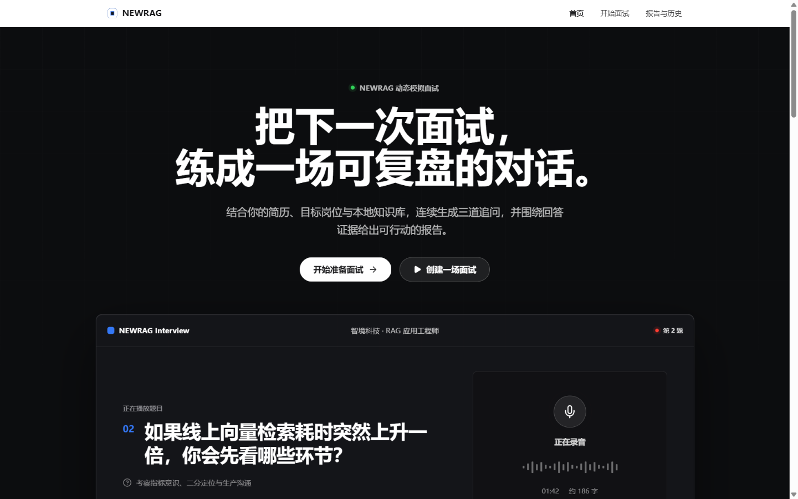
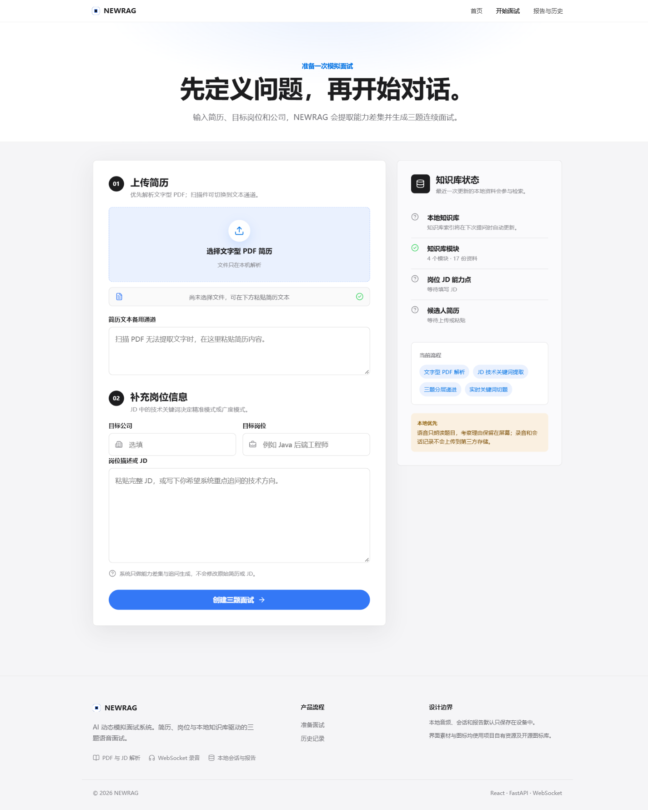
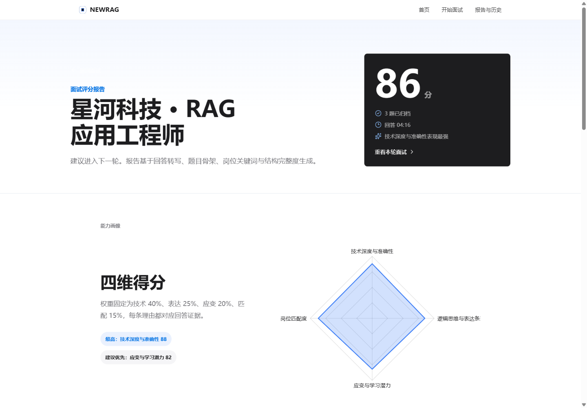
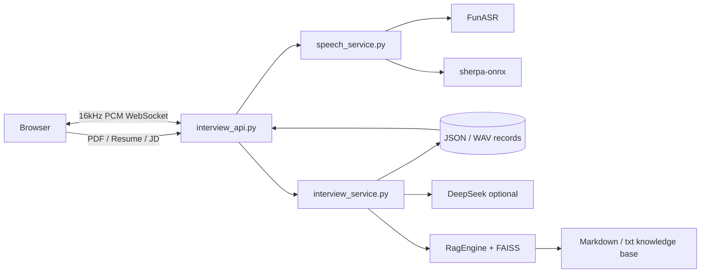

<div align="center">

# NEWRAG

**本地优先的 AI 动态模拟面试系统**

把简历、目标岗位 JD 和本地知识库转化为三题语音面试、实时切题和四维评分报告。


</div>

> 截图来自本地开发版本，展示了首页、面试准备和真实后端接入后的界面状态。



## 目录

- [项目简介](#项目简介)
- [核心能力](#核心能力)
- [界面预览](#界面预览)
- [系统架构](#系统架构)
- [技术栈](#技术栈)
- [快速开始](#快速开始)
- [配置说明](#配置说明)
- [接口概览](#接口概览)
- [测试](#测试)
- [隐私与安全](#隐私与安全)
- [设计边界与已知限制](#设计边界与已知限制)
- [目录结构](#目录结构)

## 项目简介

NEWRAG 是一个面向技术岗位面试准备的本地优先应用。用户上传文字型 PDF 简历或粘贴简历文本，再填写目标岗位、公司和 JD；系统提取岗位能力点，生成三道递进式问题，通过浏览器录音完成语音作答，并在最后一题结束后生成可复盘的四维评分报告。

项目重点不只在于调用大模型，而在于把一次面试拆成完整的工程链路：简历解析、岗位建模、题目生成、实时录音、语音转写、关键词切题、文本降级、评分解释、历史弱项沉淀和本地数据持久化。

## 核心能力

| 能力 | 说明 |
| --- | --- |
| 简历与 JD 解析 | 支持文字型 PDF 和粘贴文本，提取技术关键词并识别“精准模式”或“广度模式” |
| 动态出题 | 根据简历、JD、岗位和公司风格生成三道递进问题；DeepSeek 不可用时自动使用本地规则 |
| 浏览器语音链路 | 采集 16kHz、16-bit、单声道 PCM，通过 WebSocket 发送到 FastAPI 服务 |
| 实时切题 | 识别“回答完毕”等结束语，支持手动提交、长时间静默兜底和文本降级 |
| 四维评分 | 技术深度 40%、逻辑表达 25%、应变潜力 20%、岗位匹配度 15% |
| 历史与补强 | 保存会话、题目音频、回答音频、弱项标签和报告，并生成自动补强资料 |
| 本地优先 | 录音与记录默认留在本机；使用 DeepSeek 时只发送评分所需文本 |

## 界面预览

### 面试准备

填写简历、目标公司和岗位 JD，创建三题模拟面试。



### 四维评分报告

评分报告展示总分、能力雷达图、逐题证据、优势与下一步练习建议。



## 系统架构



服务端以 FastAPI 提供 HTTP 与 WebSocket 接口。面试领域逻辑集中在 `interview_service.py`，会话持久化位于 `interview_store.py`，语音识别与合成由 `speech_service.py` 适配。资料问答服务 `voice_api.py` 复用同一套 ASR、TTS 与 RAG 引擎。

## 技术栈

| 层 | 技术 |
| --- | --- |
| 前端 | React 19、TypeScript 6、Vite、React Router、Recharts |
| 浏览器音频 | Web Audio API、WebSocket、16kHz PCM |
| 后端 | FastAPI、Uvicorn、Pydantic、Python 3.10+ |
| 文档解析 | pypdf、python-multipart |
| 检索增强 | LangChain、FAISS、FastEmbed、BAAI/bge-small-zh-v1.5 |
| 语音能力 | FunASR、sherpa-onnx、SoundFile、g2p-en |
| 模型服务 | DeepSeek OpenAI-compatible API，可选 |
| 数据持久化 | 本地 JSON、WAV、弱项标签文件 |

## 快速开始

### 环境要求

- Git
- Python 3.10+
- Node.js 20+ 与 npm
- 麦克风权限，浏览器需要通过 `localhost` 或 HTTPS 访问
- ffmpeg/ffprobe，仅启动原语音问答服务时需要

### 1. 获取代码

```bash
git clone https://github.com/LUCHKCHEN/NEWRAG.git
cd NEWRAG
```

### 2. 安装后端

```bash
python -m venv .venv
```

Windows PowerShell：

```powershell
.\.venv\Scripts\Activate.ps1
pip install -r NEWRAG/requirements.txt
```

macOS / Linux：

```bash
source .venv/bin/activate
pip install -r NEWRAG/requirements.txt
```

### 3. 配置环境变量

```bash
cp .env.example .env
```

至少填写：

```dotenv
DEEPSEEK_API_KEY=your_deepseek_api_key
```

不配置 DeepSeek 时，题目生成和评分会降级到本地规则，报告会标记为估算结果。

### 4. 放置本地 TTS 模型

TTS 模型体积较大，不随仓库提交。将模型目录放到：

```text
NEWRAG/models/vits-melo-tts-zh_en/
```

模型可从 [csukuangfj/vits-melo-tts-zh_en](https://huggingface.co/csukuangfj/vits-melo-tts-zh_en) 获取。

### 5. 启动服务

终端一：

```bash
cd NEWRAG
python interview_api.py
```

终端二：

```bash
cd frontend
npm install
npm run dev
```

打开 `http://127.0.0.1:5173/setup`。后端健康检查位于 `http://127.0.0.1:8002/health`。

原语音资料问答服务可使用：

```bash
cd NEWRAG
python voice_api.py
```

## 配置说明

完整示例见 [.env.example](.env.example)。

| 变量 | 默认值 | 说明 |
| --- | --- | --- |
| `DEEPSEEK_API_KEY` | 空 | DeepSeek API 密钥；为空时使用本地降级评分 |
| `DEEPSEEK_BASE_URL` | `https://api.deepseek.com` | OpenAI-compatible API 地址 |
| `DEEPSEEK_CHAT_MODEL` | `deepseek-v4-flash` | 出题与评分模型 |
| `INTERVIEW_API_HOST` | `127.0.0.1` | 面试服务监听地址 |
| `INTERVIEW_API_PORT` | `8002` | 面试服务端口 |
| `INTERVIEW_RECORDS_DIR` | `../interview_records` | 面试记录目录 |
| `INTERVIEW_AUTO_REBUILD` | `1` | 评分后是否异步重建 FAISS 索引 |

前端分离部署时可设置：

```dotenv
VITE_API_BASE_URL=http://127.0.0.1:8002
VITE_WS_BASE_URL=ws://127.0.0.1:8002
```

## 接口概览

| 方法 | 路径 | 用途 |
| --- | --- | --- |
| `GET` | `/health` | 健康检查 |
| `POST` | `/api/interview/sessions` | 创建面试 |
| `GET` | `/api/interview/sessions/{id}` | 获取会话 |
| `GET` | `/api/interview/sessions/{id}/turns/{turn}/question-audio` | 获取题目音频 |
| `GET` | `/api/interview/sessions/{id}/turns/{turn}/answer-audio` | 获取回答录音 |
| `POST` | `/api/interview/sessions/{id}/finish` | 开始后台评分 |
| `GET` | `/api/interview/sessions/{id}/report` | 查询评分状态和报告 |
| `GET` | `/api/history` | 获取历史记录与弱项标签 |
| `DELETE` | `/api/history/{id}` | 删除历史记录 |
| `GET` | `/api/history/{id}/export` | 导出会话 JSON |
| `WS` | `/api/interview/sessions/{id}/turns/{turn}/answers` | 录音、转写和切题 |

完整说明见 [NEWRAG/README.md](NEWRAG/README.md)。

## 测试

后端：

```bash
cd NEWRAG
python -m unittest test_newrag.py test_voice_api.py test_interview_service.py test_interview_api.py -v
```

前端：

```bash
cd frontend
npm run build
npm run lint
```

当前测试覆盖 32 个后端用例，包括会话状态、评分降级、WebSocket 切题、音频接口、历史导出、数据隔离和 RAG 基础行为。

## 隐私与安全

- 录音、转写和面试记录默认只保存在本机。
- 使用 DeepSeek 时，简历摘要、岗位信息和回答文本会发送到所配置的模型接口。
- `.env`、模型、录音、日志、构建产物和本地数据均已加入 `.gitignore`。
- 仓库只提供 `.env.example`，不提交真实 API Key。
- 删除面试历史会同时删除对应的 JSON、题目音频和回答音频。

## 设计边界与已知限制

- FAISS 索引采用全量重建，资料量增大后重建时间会上升。
- 检索数量固定，暂未加入相关性阈值和重排序。
- 知识库目前只支持 Markdown 和 txt，不包含 Word、网页或扫描件 OCR。
- 浏览器实时转写基于已缓冲 PCM 分段调用 ASR，不是独立逐词流式识别。
- DeepSeek 不可用时评分质量受本地规则限制。
- 当前测试不会调用真实 ASR、TTS、DeepSeek 或长时间录音。

## 目录结构

```text
.
├─ frontend/                    React + TypeScript + Vite
├─ NEWRAG/
│  ├─ interview_api.py          FastAPI HTTP/WebSocket 服务
│  ├─ interview_service.py      简历解析、出题、切题与评分
│  ├─ interview_store.py        本地会话持久化
│  ├─ speech_service.py         ASR/TTS 适配层
│  ├─ voice_api.py              独立语音资料问答服务
│  └─ rag_engine.py             FAISS + DeepSeek 检索引擎
├─ data/                        本地知识库
├─ docs/images/                 README 截图
├─ interview_records/           运行时生成，不提交
└─ README.md
```

## 许可证

当前仓库暂未附加开源许可证。代码仅用于个人作品展示与学习交流；如需复用、分发或商用，请先联系作者。
